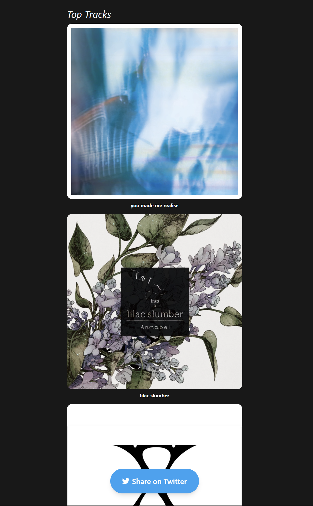

# Spotify Stats


Spotify Stats is a website that displays and shares Spotify statistics.

## Actual shared pages
https://spstats.me/c0f7e9c1-ccf8-439d-9bc3-a8f9e800b361

## Technology Stacks
- TypeScript
- Next.js
- NextAuth.js
- Prisma
- PlanetScale
- Chakra UI
- Framer Motion
- Spotify Web API
- Vercel (Hosting)

## Features
- Displays the most listened to artists and songs of logged in users
- Share the page with artists and tracks displayed
- Seamless sharing via Twitter

## Require
You need to register your [application](https://developer.spotify.com/dashboard/) first

If you want to use the database, you need to register with [PlanetScale](https://planetscale.com/)

## Run
Clone
``` bash
git clone https://github.com/kaedenano/spotify-stats
cd spotify-stats
```

Dependency Installation

``` bash
yarn
# or
npm install
```

Setting Environment Variables (.env.local)
``` bash
SPOTIFY_CLIENT_ID=xxx
SPOTIFY_CLIENT_SECRET=xxx
NEXT_PUBLIC_REDIRECT_URI=http://localhost:3000
```

Database environment variables (.env)
``` bash
DATABASE_URL='mysql:xxx'
```


Start the server
``` bash
yarn dev
# or
npm run dev
```

## Warning
Much of this project is incomplete and has not yet applied for an API, so other users cannot use it yet.

## Screenshot



## References

[Spotify for Developers](https://developer.spotify.com/documentation/web-api/)

[PlanetScale quickstart guide](https://planetscale.com/docs/tutorials/planetscale-quick-start-guide)